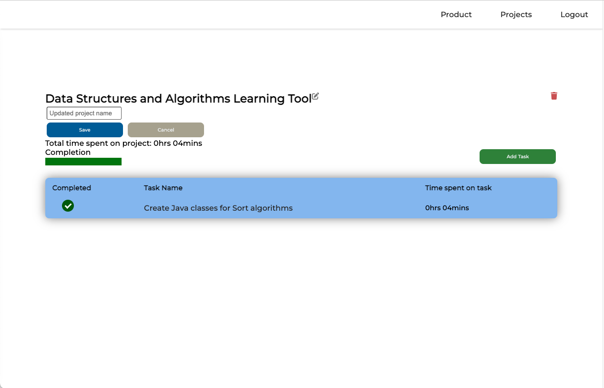
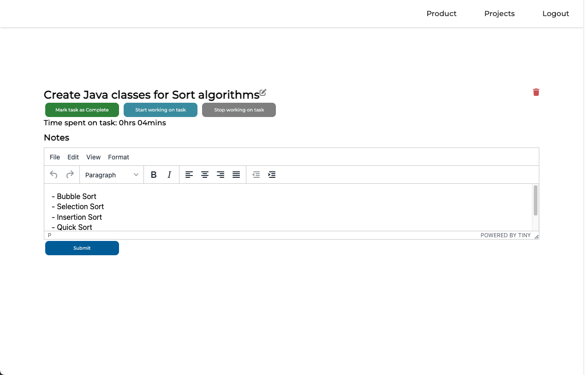

# Time-Management-Web-App
Java | Spring Boot | Auth0 | Thymeleaf | DynamoDB | CSS | DOCKER   
Project-time management system utilizing an MVC design with the primary function to help clients
get more accurate data about how long it takes for them to finish projects of certain sizes.
Useful for SCRUM teams to keep track of sprint progress and useful for schools to
utilize data to allocate or deallocate more time to students for assignments/projects.
Application enables the user to:

- [x] Sign Up/sign in
- [x] Create Projects that consists of To Do list items with each project and list item utilizing CRUD operations
- [x] Log the amount of time spent on each To Do item with total project time logged
- [x] Mark tasks as complete, updating the projects progress status

Additional Features to be implemented:
- [x] Auth0 for secure authentication and google sign in
- [x] Rich Text Editor for notes
- [x] Email service for email link verification for registration and reset username/password function
- [ ] Project collaboration with other users

## NOTE:
The deployed version of this website has been taken down temporarily. When the site is ready to be hosted again, the project
will be deployed and reachable at https://thetimelyproject.com

## Product Demo:

### Login

### Projects  - click on project name to get to project specific view!

### Create a Project

### Project specific view - click on task name to get to task view!

### Edit a project name

### Task view

### Task Started View

### Create a new task

### Marked a task as completed

